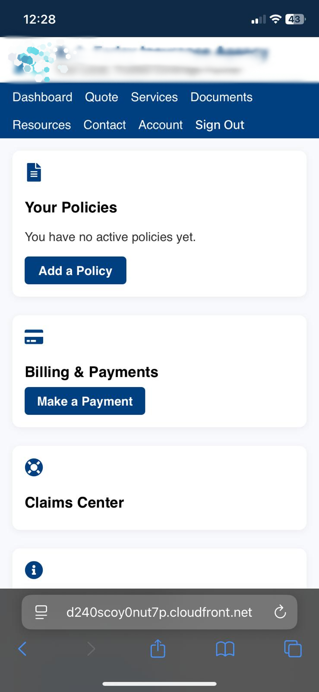

# Modern Insurance Web App

This is a responsive, mobile-friendly insurance web application built with AWS and React. It provides features for policy management, payments, claims, and account settings, designed for an insurance agency.

> 🔒 **Note:** Client name and branding have been blurred in the UI preview to respect intellectual property rights.

---

## 🚀 Features

- 📱 Mobile-first responsive UI
- 📂 Policy and Document Management
- 💳 Payments and Billing Center
- 🛠️ Claims Center and Customer Support
- 👤 Account Settings
- 📡 Real-time updates via AWS AppSync

---

## 🛠️ Tech Stack

| Category         | Technologies                                                                 |
|------------------|------------------------------------------------------------------------------|
| Frontend         | React, Tailwind CSS, React Router DOM                                        |
| Backend          | AWS Amplify, AWS AppSync (GraphQL), AWS Lambda, Amazon DynamoDB             |
| Hosting          | AWS Amplify Hosting (S3 + CloudFront)                                        |
| Auth & Security  | AWS Cognito (via Amplify UI components)                                      |
| Notifications    | Firebase Cloud Messaging (FCM)                                               |
| Assets           | Logo & UI assets stored in `/public` (excluded from Git for IP protection)  |

---

## 🧾 License

This project is licensed under the [MIT License](./LICENSE).

---

## 👤 Author

**Francis Asare Abetia**  
AWS Certified Cloud Practitioner  
GitHub: [@Cee1300](https://github.com/Cee1300)

---

## 📌 Notes

- The actual logo and agency name are excluded from the repository.
- The app is deployed via [AWS Amplify Hosting](https://d240scoy0nut7p.cloudfront.net).